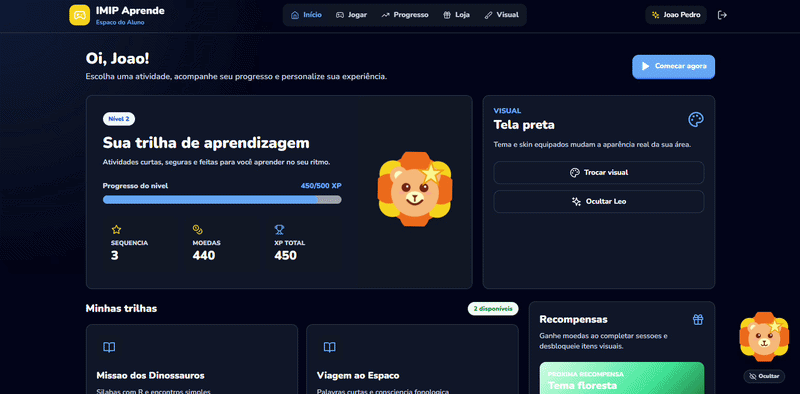

# ApoiaMais Backend

[🇺🇸 English](./README.md)

O **ApoiaMais Backend** é o backend da plataforma gamificada de alfabetização para crianças hospitalizadas: gerenciamento de usuários, atividades educacionais e ilustrações geradas por inteligência artificial para o jogo.

É uma **API principal em FastAPI** (dona do MySQL e de todas as regras de negócio) com **workers assíncronos** ligados por **RabbitMQ**: um worker Python (outbox e resultados) e um **worker em Go** para integrações lentas e caras, como o provedor de IA. Redis guarda rate limit, travas e orçamento. Detalhes e decisões em [`docs/ARQUITETURA.md`](./docs/ARQUITETURA.md).



---

### Estrutura do Projeto

```text
ApoiaMaisBackEnd/
├── app/                    # API FastAPI (camadas api/application/domain/infrastructure)
│   ├── alembic/            # migrations: única fonte do schema do MySQL
│   └── worker.py           # api-worker: outbox -> RabbitMQ e resultados dos jobs
├── workers/go-worker/      # worker Go: geração de imagens por IA (sem acesso ao MySQL)
├── contracts/events/       # JSON Schemas dos eventos (Python e Go testam contra eles)
├── docs/                   # ARQUITETURA.md
├── tests/                  # unitários e integração (MySQL e RabbitMQ reais)
├── docker-compose.yml
└── requirements.txt
```

### Clonar o repositório

```bash
git clone https://github.com/seu-usuario/apoiamais-backend.git

cd apoiamais-backend
```

### Iniciar os serviços

```bash
docker compose up --build
```

Sobem `mysql`, `migrate` (aplica as migrations e termina), `api`, `api-worker`, `go-worker`, `rabbitmq` e `redis`. Só a API publica porta, e apenas em `127.0.0.1:8000`; o resto fica na rede interna do Docker. As imagens rodam sem root, com sistema de arquivos somente leitura; após mudar o código, rode `docker compose up --build` de novo.

Por padrão o go-worker usa o provedor `fake` (gera uma imagem local, sem custo). Para usar a OpenAI, defina `AI_PROVIDER=openai` e `OPENAI_API_KEY` no `.env`.

`/docs` e `/openapi.json` ficam desligados; para desenvolvimento, use `ENABLE_DOCS=true` no `.env`.

### Primeiro professor

Os cadastros (`POST /api/users/students` e `/teachers`) exigem um professor autenticado. O primeiro é criado direto no banco:

```bash
docker compose exec api python -m scripts.criar_usuario --role teacher --nome "Professor" --email professor@exemplo.dev --senha "uma-senha-forte"
```

### Autorização e rate limiting

A matriz de quem acessa cada rota está no topo de `app/api/routes/users.py` e é verificada por `tests/integration/api/test_authorization_matrix.py`. Os limites (`RATE_LIMIT_DEFAULT`, `RATE_LIMIT_LOGIN`, `RATE_LIMIT_USER_CREATION`, `RATE_LIMIT_AI_IMAGE`) são configurados no `.env` e contam por usuário autenticado (no hospital vários tablets saem pelo mesmo IP); sem token, e no login, contam por IP; com `REDIS_URL` definido os contadores ficam no Redis, sem ele ficam em memória (vale só para um processo). Ao estourar o limite a API responde `429` com o cabeçalho `Retry-After`.

Todas as respostas de erro seguem o formato `{"success": false, "message": "...", "errors": [...]}`. Toda resposta traz `X-Correlation-ID` (o mesmo valor aparece nos logs da API e dos workers).

### Ilustrações por IA no jogo

1. Quando a criança abre uma fase, o jogo chama `POST /api/stages/{stage_id}/illustration` (aluno ou professor).
2. Se a fase já tem imagem, a resposta é `200` com `image_url`. Senão, `202` com `status: pending` e `retry_after_seconds`.
3. O jogo consulta `GET /api/ai-images/{id}` até `completed` (ou `failed`: use a ilustração padrão).
4. A imagem é baixada com o mesmo token em `GET /api/ai-images/{id}/content`.

O prompt é montado no servidor a partir do tema da fase: nenhum dado da criança vai para o provedor de IA.
### Organização interna da API

```text
app/api/             rotas, dependências (injeção), middleware, handlers de erro
app/application/     casos de uso, DTOs, eventos (envelope e payloads)
app/domain/          entidades, enums, exceções, interfaces de repositório e serviços
app/infrastructure/  SQLAlchemy, repositórios, segurança, mensageria, storage, rate limit
```

---

### Fluxo da Aplicação

```text
Jogo / frontend
    │  HTTPS (única porta exposta)
    ▼
api (FastAPI) ──────────────► MySQL (schema via Alembic)
    │  grava evento no outbox (mesma transação)
    ▼
api-worker ──► RabbitMQ ──► go-worker ──► provedor de IA
    ▲                           │
    └──── resultados ◄──────────┘  grava PNG no volume/S3; a API serve a imagem
```

### Contrato da API

O código deste repositório é a fonte da verdade do contrato da API. Os contratos OpenAPI aprovados ficam no repositório de integração ([ApoiaMaisTech/ApoiaMais](https://github.com/ApoiaMaisTech/ApoiaMais)), em `contratos/<servico>.yaml`, e o frontend gera seus tipos a partir deles. Nenhum contrato é escrito à mão.

Os serviços exportados estão listados em `contratos.json` (nome do contrato, pasta, `modulo:variavel` do app e, opcionalmente, variáveis de ambiente fictícias que o import exige).

**Exportar localmente** (não precisa de MySQL, RabbitMQ nem Redis, e nem de `.env`):

```bash
pip install -r requirements.txt
python scripts/exportar_contratos.py --saida ../ApoiaMais/contratos
```

- `--so auth-service`: exporta apenas os serviços informados.
- `--docker`: exporta dentro do container de cada serviço (`docker compose run --rm --no-deps -T`), útil quando as dependências locais não batem. Requer o `.env` usado pelo `docker-compose.yml`.
- Para exportar um único app: `python scripts/exportar_openapi.py --app main:app --dir . --saida auth-service.yaml` (sem `--saida`, imprime no stdout). Rodando direto, as variáveis exigidas pelo `app/core/config.py` (`DB_USER`, `DB_NAME`, `JWT_SECRET_KEY`) precisam estar no ambiente ou no `.env`; o `exportar_contratos.py` já as preenche com valores fictícios.

**Automação** (`.github/workflows/sync-contrato.yml`): a cada push na `main` que altere o código da API, `contratos.json` ou `scripts/` (ou manualmente, via *Run workflow*), o GitHub Actions exporta os contratos e abre — ou atualiza — um PR no repositório de integração na branch `contrato/sync-backend`, com as labels `contrato` e `automatico` e o link do commit de origem. Se o contrato não mudou, nenhum PR é aberto. O workflow usa um GitHub App (`vars.APP_ID` e `secrets.APP_PRIVATE_KEY`) para que o PR dispare os workflows de validação do repositório de integração.

### Documentação

Toda a documentação do projeto está localizada no diretório `docs/`.

```text
docs/
└── images/
