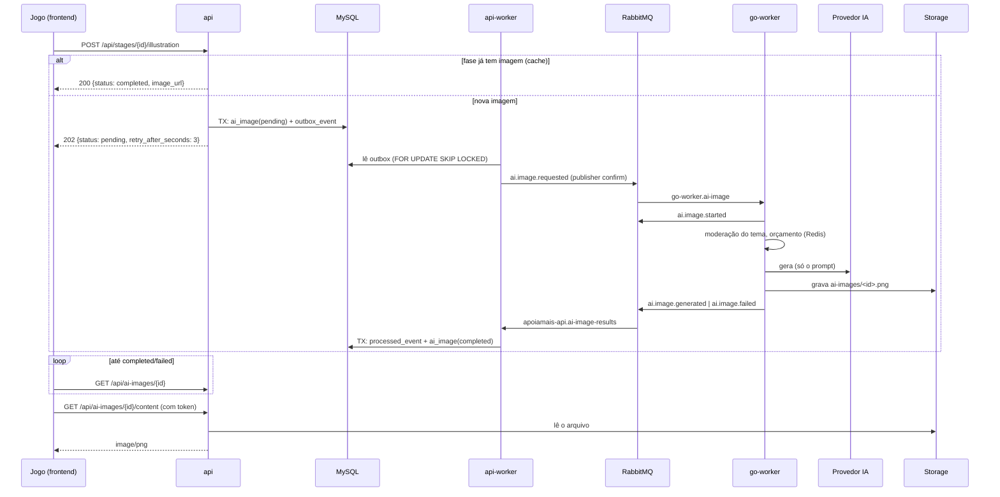
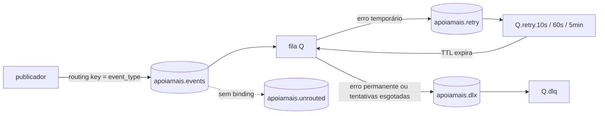

# Arquitetura do backend ApoiaMais

Documento de referência das decisões tomadas na evolução do backend (FastAPI + Go).
Para rodar o projeto, veja o [README](../README.pt-BR.md).

## Visão geral

```
Frontend React/Vite (jogo)
        |  HTTPS (só a API é exposta)
        v
+---------------------+      outbox (mesma transação)      +-----------------+
| api  (FastAPI)      | ---------------------------------> | MySQL           |
| authN/authZ, regras |                                    | (dono: a API)   |
+---------------------+                                    +-----------------+
        ^                                                          ^
        | lê imagens (somente leitura)                             | resultados
        |                                                          |
  [volume media / S3]     +----------------------------+          |
        ^                 | api-worker (python -m      |----------+
        |                 | app.worker): outbox->broker|
        |                 | e consumidor de resultados |
        |                 +----------------------------+
        |                        |            ^
        |                        v            |
        |                 +--------------------------+
        |                 | RabbitMQ apoiamais.events|
        |                 +--------------------------+
        |                        |            ^
        |                        v            |
        |                 +--------------------------+      +-------+
        +-----------------| go-worker (Go)           |----->| Redis |
          grava PNG       | provedor de IA, sem MySQL|      +-------+
                          +--------------------------+
```

| Componente | Responsabilidade | Acesso ao MySQL |
|---|---|---|
| `api` (FastAPI) | Rotas HTTP, autenticação, autorização, regras de negócio, grava eventos no outbox | Sim (único dono do schema, via Alembic) |
| `api-worker` (mesma imagem, `python -m app.worker`) | Publica o outbox no RabbitMQ; consome resultados dos jobs e atualiza o MySQL | Sim |
| `migrate` | `alembic upgrade head` antes de `api`/`api-worker` subirem | Sim |
| `go-worker` (Go) | Integrações externas e I/O lento: geração de imagens por IA | **Não** (decisão de projeto) |
| RabbitMQ | Comunicação assíncrona entre API e workers | — |
| Redis | Rate limit da API; idempotência, trava e orçamento diário do go-worker | — |

### Por que o go-worker não acessa o MySQL

- Um único dono do schema (Alembic na API): nenhuma migração quebra outro serviço.
- Toda regra de negócio fica num lugar só; o worker só executa o job.
- Entrada do job vem no evento; saída volta como evento e a API persiste.
- Menos credenciais espalhadas: o worker não tem senha do banco.

### Onde Go faz sentido (e onde não)

**Go:** chamadas lentas, caras e instáveis a terceiros (provedor de IA), com controle
fino de concorrência, timeout e orçamento, isoladas do processo da API. Futuras
notificações (e-mail/push) e geração de relatórios (PDF) seguem o mesmo padrão.

**FastAPI:** CRUD, autenticação, regras de gamificação, validação e tudo que lê ou
grava no MySQL.

### Rust: ainda não

Não há carga CPU-bound hoje. Avaliar exercícios de alfabetização (comparar resposta,
distância de edição, normalização de acentos) custa microssegundos em Python.
Rust passa a valer a pena quando houver: avaliação de **áudio/pronúncia**
(`AIContentType.AUDIO`), pontuação em lote com p95 medido acima do aceitável, ou
execução isolada (sandbox/WASM). Antes de um serviço novo, considere uma extensão
Python em Rust (PyO3). O contrato `evaluation.*` segue o mesmo envelope deste documento.

## Ilustrações por IA no jogo

Quando a criança abre uma fase, o jogo pede a ilustração da fase.



### Estados

`pending` → `processing` → `completed` | `failed`. As transições só avançam
(um `started` atrasado não desfaz um `completed`).

Em `failed` o jogo mostra a ilustração padrão da fase. Um novo pedido para a mesma
fase só cria outro job depois de `AI_IMAGE_FAILURE_COOLDOWN_MINUTES`.

### Segurança, LGPD e custo

- **O prompt é montado só no servidor** (`app/domain/services/illustration_prompt.py`):
  template fixo + nome do mundo e da fase. Nenhum dado da criança (nome, idade,
  diagnóstico, ids) vai ao provedor; o jogo não envia texto livre (sem injeção de prompt).
- O template pede ilustração infantil, sem texto, sem violência e **sem ambiente hospitalar**.
- **Moderação**: o go-worker bloqueia temas com termos impróprios antes de chamar o
  provedor; o provedor (OpenAI, `moderation=auto`) modera entrada e saída; a imagem é
  validada como PNG antes de ser gravada.
- **Cache por fase**: todas as crianças da fase recebem a mesma imagem (`dedupe_key`
  único no MySQL impede jobs duplicados mesmo com pedidos simultâneos).
- **Custo**: cota diária por usuário (`AI_IMAGE_DAILY_QUOTA_PER_USER`, só para jobs
  novos), orçamento diário global no go-worker (`AI_DAILY_IMAGE_BUDGET`, fecha se o
  Redis cair), reaproveitamento da imagem já gravada em caso de reentrega.
- **Sem rota vazando**: storage, RabbitMQ (sem plugin de management) e go-worker não
  publicam porta; a imagem é servida pela API com autenticação, nunca por URL do
  storage; `/docs`, `/redoc` e `/openapi.json` ficam desligados (`ENABLE_DOCS=false`).
- O resultado do worker só é aceito se `storage_key` for exatamente a chave que a API
  definiu (`ai-images/<id>.png`).

### Storage

Interface única (`app/infrastructure/storage`, `workers/go-worker/internal/storage`):

- `STORAGE_BACKEND=local`: volume Docker `media` (go-worker grava, API lê somente leitura).
- `STORAGE_BACKEND=s3`: S3 ou compatível (MinIO, SeaweedFS). Testado contra SeaweedFS.

## Mensageria

### Envelope (todas as mensagens)

```json
{
  "event_id": "uuid",
  "event_type": "ai.image.requested",
  "version": 1,
  "occurred_at": "2026-10-05T12:00:00Z",
  "producer": "apoiamais-api",
  "correlation_id": "id-da-requisicao",
  "job_id": "uuid ou null",
  "payload": {}
}
```

Contratos em [`contracts/events`](../contracts/events) (JSON Schema), validados nos
testes Python **e** Go a partir dos mesmos exemplos. Mudança aditiva e opcional mantém
a versão; qualquer outra cria `vN+1` e os consumidores aceitam as duas na transição.

### Topologia

| Exchange | Tipo | Uso |
|---|---|---|
| `apoiamais.events` | topic | todos os eventos; routing key = `event_type`. `alternate-exchange` = `apoiamais.unrouted` |
| `apoiamais.unrouted` | fanout | eventos sem fila de destino (nada se perde se um consumidor ainda não subiu) |
| `apoiamais.retry` | direct | filas de espera do retry |
| `apoiamais.dlx` | direct | dead letter |

| Fila | Binding | Consumidor |
|---|---|---|
| `go-worker.ai-image` | `ai.image.requested` | go-worker |
| `apoiamais-api.ai-image-results` | `ai.image.started`, `ai.image.generated`, `ai.image.failed` | api-worker |

Cada fila `Q` tem: `Q` (quorum, `x-delivery-limit=10`, DLX), `Q.retry.10000`,
`Q.retry.60000`, `Q.retry.300000` (TTL, voltam para `Q`) e `Q.dlq`.



### Garantias

- **Ack manual** e prefetch (`MESSAGING_PREFETCH`, `WORKER_CONCURRENCY`).
- **Retry com backoff** (10 s, 60 s, 5 min; `x-retry-count` no header) até
  `MESSAGING_MAX_RETRIES`/`MAX_RETRIES`; depois, **DLQ**.
- **Erro permanente** (envelope inválido, versão desconhecida, payload fora do contrato) vai direto para a DLQ.
- **Outbox**: o evento é gravado na mesma transação do dado; o relay publica com
  publisher confirms e tenta de novo com backoff se o broker estiver fora. Com o
  RabbitMQ parado a API continua respondendo.
- **Idempotência**: consumidor Python registra `processed_event` (consumer, event_id)
  na mesma transação; go-worker usa Redis (`aiimg:done`, trava com token) e não chama
  o provedor de novo se a imagem já estiver no storage.
- **Reconexão**: os dois consumidores têm laço explícito de reconexão (testado com
  restart real do RabbitMQ).

## Observabilidade

- Logs JSON (structlog na API, `log/slog` no Go) com `correlation_id` do header
  `X-Correlation-ID` (gerado se ausente ou inválido), propagado pelos eventos até o go-worker.
- Log de acesso estruturado na API (método, rota, status, duração; sem query string).
- Healthchecks: API `/health/live` (processo) e `/health/ready` (banco); api-worker
  por heartbeat; go-worker `/healthz` e `/readyz` (RabbitMQ + Redis) só na rede interna.

## Testes

| Onde | O quê |
|---|---|
| `tests/unit` | casos de uso, prompt, contratos (JSON Schema x Pydantic), storage |
| `tests/integration/api` | rotas, autorização, rate limit por usuário, docs fechadas, correlation id |
| `tests/integration/messaging` | MySQL real (outbox, inbox, transições) e RabbitMQ real (ack, retry, DLQ, unrouted, reconexão) |
| `workers/go-worker/...` | handler, moderação, provedores (httptest), Redis (miniredis), storage, broker com RabbitMQ real |

Testes opcionais de S3: `S3_TEST_ENDPOINT`/`S3_TEST_BUCKET` (ver `tests/unit/test_storage.py`).
